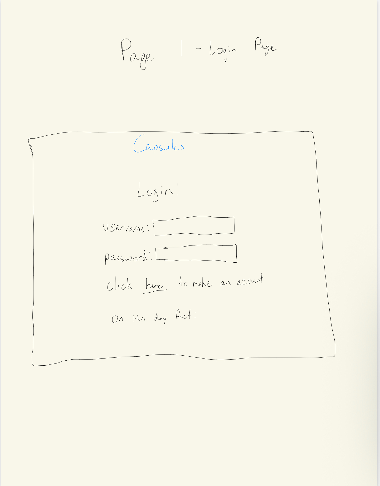
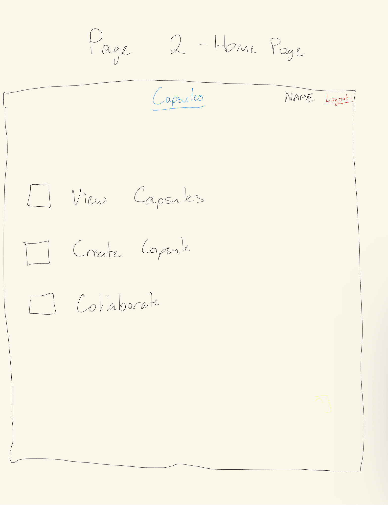
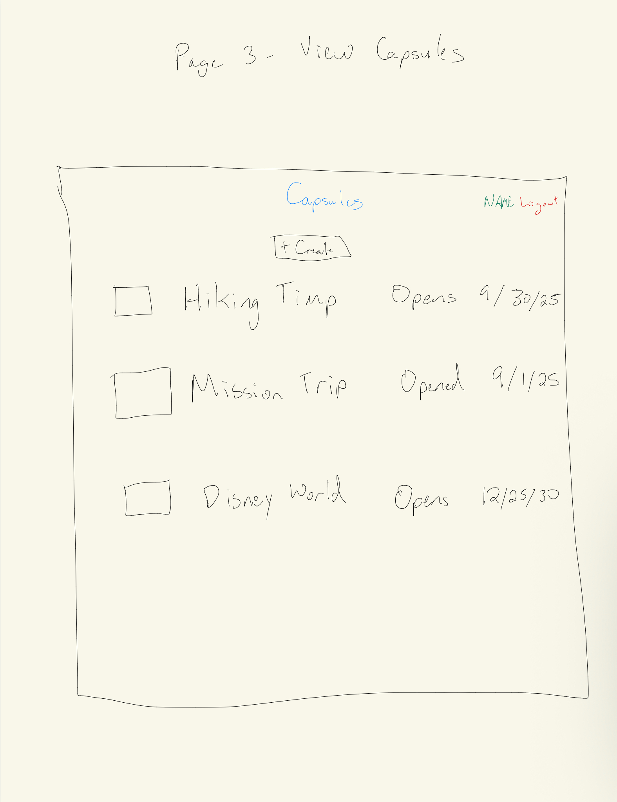
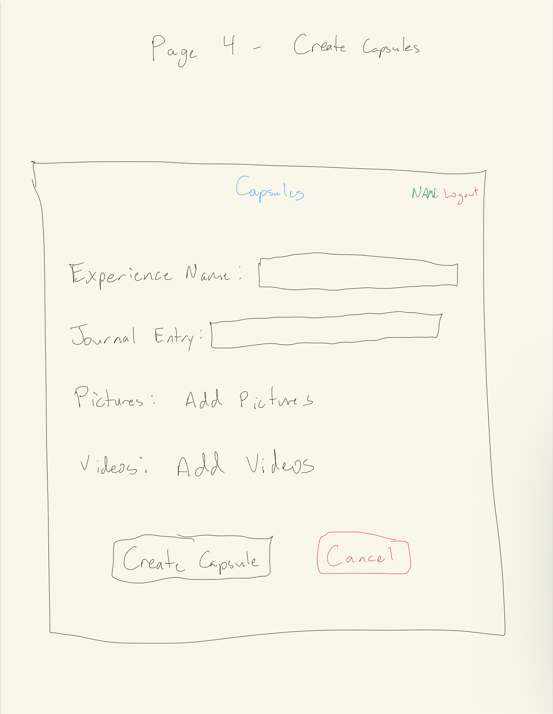
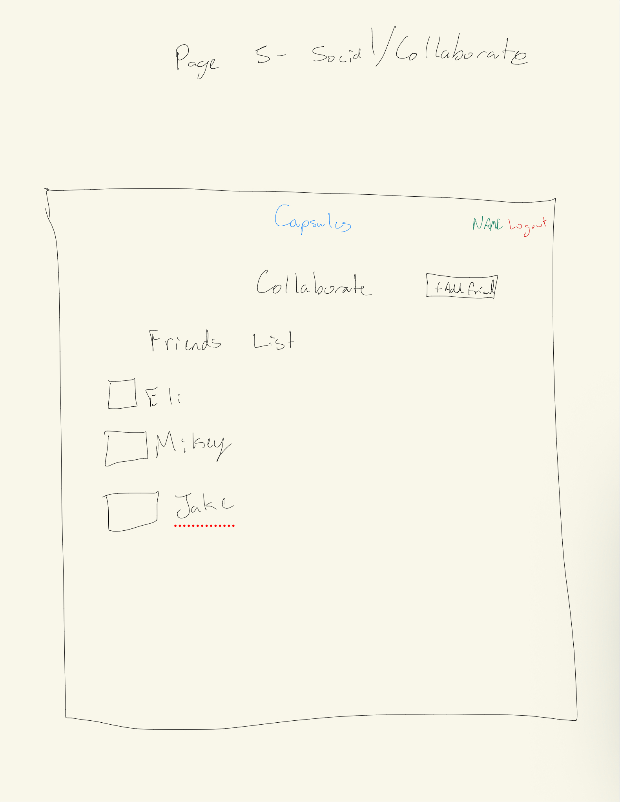

# Capsules

[My Notes](notes.md)

I am planning on creating a website that functions as a digital time capsule. There will be opportunities to share the capsules you create with friends and family.

## 🚀 Specification Deliverable

> [!NOTE]
>  Fill in this sections as the submission artifact for this deliverable. You can refer to this [example](https://github.com/webprogramming260/startup-example/blob/main/README.md) for inspiration.

For this deliverable I did the following. I checked the box `[x]` and added a description for things I completed.

- [x] Proper use of Markdown
- [x] A concise and compelling elevator pitch
- [x] Description of key features
- [x] Description of how you will use each technology
- [x] One or more rough sketches of your application. Images must be embedded in this file using Markdown image references.

### Elevator pitch

Have you ever wanted to encapsulate a moment in time? With this website, that dream is now a reality! Introducing Capsules, a website that creates a virtual time capsule curated by you. This time capsule will include features such as uploading images/videos, journaling about them, and sharing those capsules with friends. Come be a part of the Capsules team now!

### Design

#### Rough Sketch of Application

Here is a rough sketch of my application. Each page represents a different page of the website.

### Key features

- There will be a login page. From the login page you will be able to create your account.
- Once you are logged in, you will be at the home page. The home page will lead to the View Capsules Page, Create Capsule Page, and Social Page.
- View Capsules Page views current capsules.
- Create Capsule Page creates a new capsule.
- Social Page allows you to connect with friends and collaborate on capsules.
- At any time, you can logout of your account.

### Technologies

I am going to use the required technologies in the following ways.

- **HTML** - HTML will be used to create the main structure of the application. There will be 5 main pages, with possibly more added in the future. 5 main pages are disucssed in Key Features. 
- **CSS** - CSS will be used to apply styling to create consistent, professional feel amongs the main pages. It will also look good on any screen the website is rendered on.
- **React** - React will be used to handle the components of the website. Provides the logic of which components to display at what time.
- **Service** - Backend Service will have endpoints for logging in, accessing capsule database, creating capsules, adding friends, and seeing friends lists. A third party service will be used to display a random fact about the day you are logging in on (September 10).
- **DB/Login** - Stores the users and their credentials in a database. Database will also store the capsule information for each user.
- **WebSocket** - Websocket will allow users to connect with other users and become "friends" on the website. The friend requests will be broadcasted to other users.

## 🚀 AWS deliverable

For this deliverable I did the following. I checked the box `[x]` and added a description for things I completed.

- [x] **Server deployed and accessible with custom domain name** - [My server link](https://yourdomainnamehere.click).

## 🚀 HTML deliverable

For this deliverable I did the following. I checked the box `[x]` and added a description for things I completed.

- [x] **HTML pages** - I created a page for each step of the website. collaborate.html (social function of app), create_account (create an account), create_capsules.html (create capsule), index.html (login), post_login (home page after logging in), view_capsules (view current capsules)
- [x] **Proper HTML element usage** - I created many HTML pages that I hope to finish throughout the semester.s
- [x] **Links** - The pages link to each other to make an interconnected webpage. I also linked my Github at the footer of each page.
- [x] **Text** - There is a bunch of text throughout my HTML pages.
- [x] **3rd party API placeholder** - I have a placeholder on the login (index.html) page.
- [x] **Images** - I have an image on the login page.
- [x] **Login placeholder** - I have a placeholder for login and logout on the website. I also have a placeholder for creating an account.
- [x] **DB data placeholder** - I created placeholders for adding to database and reading from database in create_capsules.html and view_capsules.html.
- [x]  **WebSocket placeholder** - I put a placeholder for the websocket interaction in the social page.

## 🚀 CSS deliverable

For this deliverable I did the following. I checked the box `[x]` and added a description for things I completed.

- [x]  **Header, footer, and main content body** - I added styling to the header, footer, and main that gave each page the same look and feel.
- [x]  **Navigation elements** - I changed some of the links to have a different color.
- [x]  **Responsive to window resizing** - The website is responsive to window resizing.
- [x]  **Application elements** - Application is properly styled.
- [x] **Application text content** - Changed text color in main to navy blue instead of black.
- [x]  **Application images** - There are images on my application.

## 🚀 React part 1: Routing deliverable

For this deliverable I did the following. I checked the box `[x]` and added a description for things I completed.

- [x] **Bundled using Vite** - I used vite to bundle everything.
- [x] **Components** - I created a component for each web page.
- [x] **Router** - I created a router that routes to each page. I created another router handling whether the user is logged in or not.

## 🚀 React part 2: Reactivity deliverable

For this deliverable I did the following. I checked the box `[x]` and added a description for things I completed.

- [ ] **All functionality implemented or mocked out** - I did not complete this part of the deliverable.
- [ ] **Hooks** - I did not complete this part of the deliverable.

## 🚀 Service deliverable

For this deliverable I did the following. I checked the box `[x]` and added a description for things I completed.

- [ ] **Node.js/Express HTTP service** - I did not complete this part of the deliverable.
- [ ] **Static middleware for frontend** - I did not complete this part of the deliverable.
- [ ] **Calls to third party endpoints** - I did not complete this part of the deliverable.
- [ ] **Backend service endpoints** - I did not complete this part of the deliverable.
- [ ] **Frontend calls service endpoints** - I did not complete this part of the deliverable.
- [ ] **Supports registration, login, logout, and restricted endpoint** - I did not complete this part of the deliverable.

## 🚀 DB deliverable

For this deliverable I did the following. I checked the box `[x]` and added a description for things I completed.

- [ ] **Stores data in MongoDB** - I did not complete this part of the deliverable.
- [ ] **Stores credentials in MongoDB** - I did not complete this part of the deliverable.

## 🚀 WebSocket deliverable

For this deliverable I did the following. I checked the box `[x]` and added a description for things I completed.

- [ ] **Backend listens for WebSocket connection** - I did not complete this part of the deliverable.
- [ ] **Frontend makes WebSocket connection** - I did not complete this part of the deliverable.
- [ ] **Data sent over WebSocket connection** - I did not complete this part of the deliverable.
- [ ] **WebSocket data displayed** - I did not complete this part of the deliverable.
- [ ] **Application is fully functional** - I did not complete this part of the deliverable.
